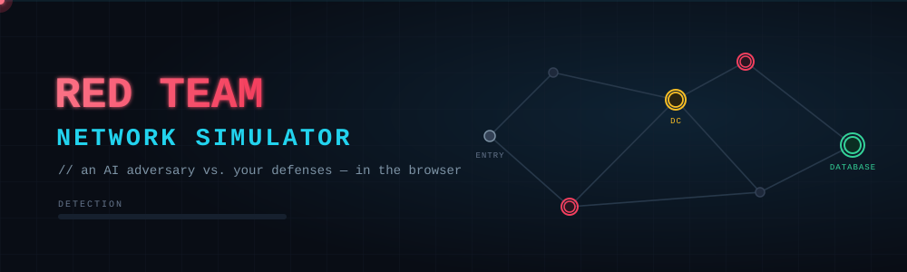
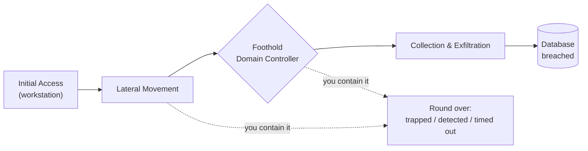
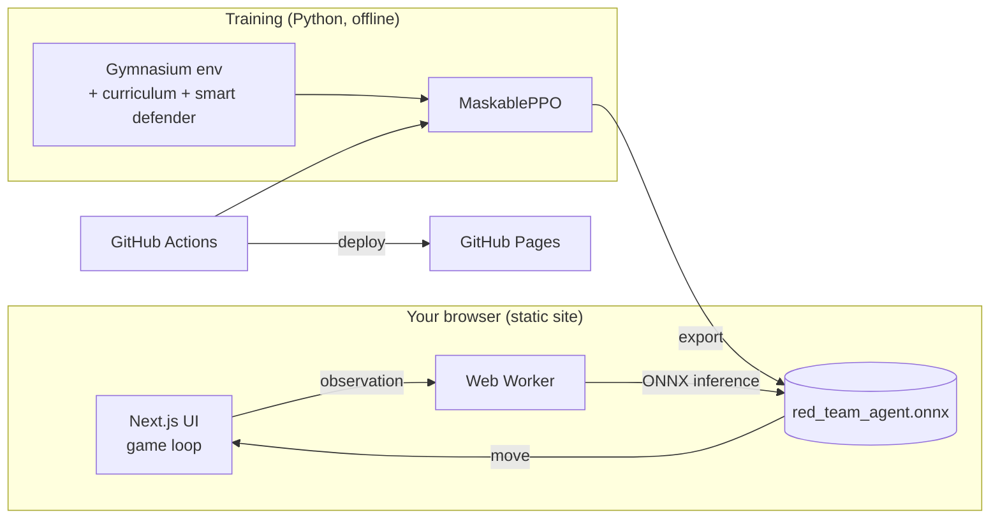

<div align="center">



<br/>


<br/><br/>


### [&#9654;&nbsp; Play it live](https://jmtchan.github.io/red-team-sim/)

</div>

---

> An interactive, browser-based reinforcement-learning game. You play **Blue Team** &mdash; defend a procedurally generated network against a **Red Team** AI agent that pathfinds in real time toward your database. The catch: the attacker is a *trained* PPO policy, not a script, and it runs **entirely in your browser** via `onnxruntime-web`. No backend, no server, no setup.

## The idea

Most ways to learn security are passive &mdash; you read about kill chains and defense-in-depth. This flips it: you go up against a live adversary that actually plays to win, and you *feel* why a single firewall isn't enough.

A reinforcement-learning agent lands on a workstation, pivots laterally toward a domain controller (the **foothold**), then tries to exfiltrate from the **database** (the crown jewels). Your job is to stop it before it gets there &mdash; placing firewalls, deception, monitoring, and containment, on a tight credit budget, in real time. Because the agent is trained rather than scripted, it routes around your defenses, hunts for the soft way in, and adapts every round. You're not memorizing a checklist; you're thinking like a defender against something that thinks back.

## How a round plays out



<!--
  HIGH-IMPACT ADD: drop in a real gameplay recording here.
  Record a round, export it as a GIF, save it to .github/assets/demo.gif,
  then uncomment the line below:
  <p align="center"></p>
-->

The database stays **locked** until the agent secures the foothold &mdash; mirroring a real intrusion, where you can't exfiltrate the crown jewels until you've established privileged access. Every round ends with an **incident report**: an after-action breakdown of what the attacker did and how it got caught (or didn't), like an analyst's write-up.

## How it works



The agent's policy is trained offline with **MaskablePPO** (action masking keeps it to legal moves), exported to ONNX, and executed client-side in a Web Worker so the UI never blocks. The worker samples each move from the policy (temperature-controlled) rather than taking the greedy argmax &mdash; that keeps play decisive without falling into deterministic loops.

> If `red_team_agent.onnx` is missing, the app falls back to a greedy heuristic agent (you'll see `HEURISTIC AGENT` in the header) so it's playable before any model exists. Once a trained model is present, the header switches to `ONNX POLICY`.

## Defenses &mdash; and what each one teaches

| Tool | In-game effect | Real-world concept |
| --- | --- | --- |
| **Firewall** | Penetrable barrier &mdash; the agent must breach it (and risks detection) | Network segmentation |
| **Honeypot** | Probabilistic trap; springing it ends the intrusion | Deception / canary tokens |
| **Tarpit** | Slows the agent down | Rate limiting / throttling |
| **Monitor** | Raises the detection meter as the agent passes | IDS / EDR / SIEM |
| **Sever** | Cuts a link (can't fully wall off &mdash; a route always survives) | Isolation / containment |
| **Corrupt** | Scrambles the agent's next move | Active defense / disruption |

## The learning angle

- **It maps to real frameworks.** The attack stages follow the **MITRE ATT&CK** kill chain (Initial Access &rarr; Lateral Movement &rarr; Privilege Escalation &rarr; Exfiltration), surfaced live in the HUD. Nodes are typed as real assets (workstation, web server, app server, domain controller, database).
- **You learn by doing.** Layering deception + monitoring + segmentation beats any single wall &mdash; and you discover that by losing rounds, not reading bullet points.
- **After-action analysis.** Each round's incident report reconstructs what happened and why, the way a SOC analyst would.
- **A built-in Field Guide** maps every mechanic to the technique it represents.

## Difficulty tiers

| Tier | Agent speed | Credits | Board density |
| --- | --- | --- | --- |
| **Recruit** | Gentle | Generous | Sparse |
| **Operator** | Faster | Tighter | Denser |
| **Elite** | Ruthless | Lean | Dense |

The agent is trained on a **curriculum** that ramps board difficulty and defender competence together &mdash; a smart, route-targeting defender places defenses on the agent's likely path &mdash; so a single model stays competent from a sparse Recruit board up to a dense Elite one.

## Tech stack

- **Frontend:** Next.js (App Router) + Tailwind CSS, statically exported &mdash; deployable to GitHub Pages with zero infrastructure.
- **Agent inference:** ONNX model run client-side via `onnxruntime-web` in a Web Worker.
- **Training:** `gymnasium` + `stable-baselines3` / `sb3-contrib` (MaskablePPO), PyTorch, exported to `.onnx`.
- **CI/CD:** GitHub Actions trains the agent (manual dispatch / configurable schedule) and commits the new weights back to `main`; a separate workflow deploys to Pages.
- **Leaderboard (optional):** a Cloudflare Worker backed by KV, with per-difficulty boards. Disabled by default.

## Run it locally

```bash
git clone https://github.com/jmtchan/red-team-sim.git
cd red-team-sim
npm install
npm run dev          # http://localhost:3000
```

```bash
npm run build        # static export to ./out
```

## Train your own agent

```bash
pip install -r training/requirements.txt
python training/train.py     # writes training/latest_model.zip + public/red_team_agent.onnx
```

`training/env.py` is the Gymnasium environment (five mechanics, the multi-objective, the detection model, and the difficulty curriculum); `training/train.py` runs MaskablePPO and exports the ONNX policy. The observation contract is fixed and shape-preserving, so a freshly trained model is a drop-in replacement &mdash; no frontend changes needed.

> **Tip:** to get the full easy&rarr;hard curriculum, start fresh (delete `training/latest_model.zip`). Resuming a model already past the ramp pins difficulty at maximum. Never delete `public/red_team_agent.onnx` &mdash; it keeps the live site served until a new model is ready.

## Roadmap

- Scenario mode &mdash; named challenges on fixed seeds with stated objectives.
- A co-trained defender (self-play) for an even tougher adversary.
- A fog-of-war / partial-observability mode (and the recurrent agent it would justify).
- Difficulty-scaled agent temperament (looser on Recruit, ruthless on Elite).

## License

MIT &mdash; see [`LICENSE`](LICENSE).

<div align="center"><sub>Built as a hands-on way to make security concepts something you can play, not just read.</sub></div>
